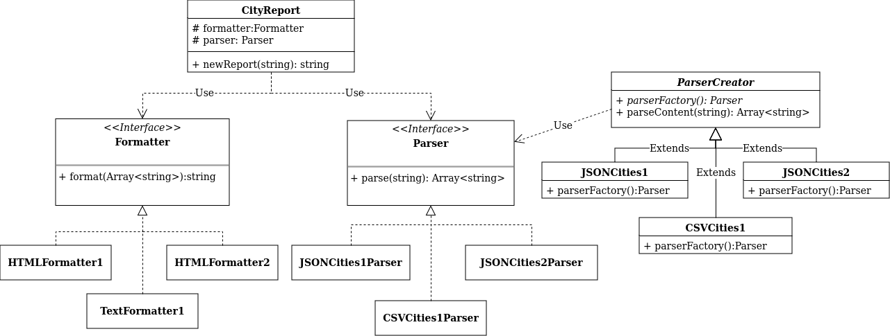

# Projeto 1

## Description

Este projeto visa comtemplar os requisitos em [requirements](./requirements)
Onde o objetivo é ler um arquivo contendo dados de cidades brasileiras e gerar
um relatório de saída.

Os tipos de dados de entradas não são especificados e foram inferidos daqueles
disponíveis em [data](./data).

Já os tipos de dados de saída são especificados em [requirements](./requirements).

## Usage

### Script

Para executar o projeto, basta executar o script start, ele executará o projeto
com o arquivo de entrada [cidades-1.json](./data/cidades-1.json) e o formato de saída `html_1`.

```bash
npm install
npm start
```

### CLI

Para executar o projeto via CLI, basta executar o comando:

```bash
npm install
npm run build
./lib/bin/city_reporter.js (arguments)
```

#### Arguments

1. --help, -h:
    - Mostra os argumentos
2. --parser, -p:
    - Qual tipo de arquivo de entrada, considerando o código original podem ser três tipos:
        - json_1 (cidades-1.json)
        - json_2 (cidades_2.json)
        - csv_1 (cidades.csv)
3. --format, -f:

    - Qual tipo de formato de saída, dado os requerimentos há três possibilidades
        - html_1
        - html_2
        - text_1

4. --in-file, -i:
    - O Arquivo de entrada que contém as cidades para fazer o relatório (deve
      estar no formato especificado pelo argumento --parser)
5. --out-file, -o (opcional):
    - Arquivo para escrever o resultado do relatório, se nada for especificado
      o resulto será impresso na tela.

##### Exemplos

```bash
./lib/bin/city_reporter.js -p json_1 -f html_1 -i data/cidades-1.json -o out.html
```

```bash
./lib/bin/city_reporter.js -p json_2 -f html_2 -i data/cidades-2.json -o out.html
```

```bash
./lib/bin/city_reporter.js -p csv_1 -f text_1 -i data/cidades.csv -o out.txt
```

### npm package

O projeto também pode ser instalado via npm:

```bash
npm install @paradoxo/city-reporter
```

E para executar o cli é necessário utilizar o comando `npx` juntamente com o nome do pacote:
E claro que os arquivos contendo as cidades devem ser passados como argumento e estarem
presentes no diretório `data` de onde for executar o comando.

```bash
npx city-reporter -p json_1 -f html_1 -i data/cidades-1.json -o out.html
```

## Arquitetura



A arquitetura do sistema é composta por três componentes principais:

1. **Parser**: Responsável por ler o arquivo de entrada e transformar em um objeto
   que possa ser utilizado pelo sistema.
2. **Formatter**: Responsável por formatar o objeto de entrada em um formato específico
3. **Reporter**: Responsável por juntar o parser e o formatter e gerar o relatório final

### Padrões de Design

#### Factory Method

O padrão de design Factory Method foi utilizado para criar os parsers, onde a classe
`ParserCreator` é responsável por criar o parser correto de acordo com o tipo de arquivo
de entrada.

#### Strategy

O padrão de design Strategy foi utilizado para criar os formatters, já que cada tipo de
formato de saída é uma estratégia diferente.

#### Facade

O padrão de design Facade foi utilizado para criar o `CityReporter`, que é responsável por
juntar o parser e o formatter e gerar o relatório final, abstraindo a complexidade de
criar um relatório do usuário.
